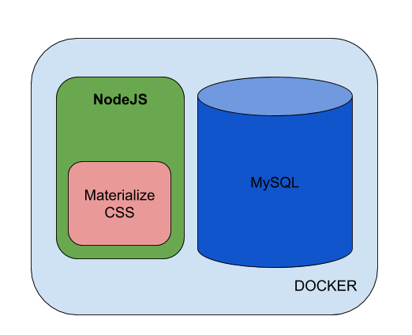

Autor: Ciro Edgardo Romero - 2020

# Introducción

En un contexto de innovación tecnológica, la integración de sistemas informáticos con componentes electrónicos es la piedra fundamental cuando se desarrollan proyectos en [Internet de las Cosas]( https://es.wikipedia.org/wiki/Internet_de_las_cosas).
Este pequeño proyecto, sirve para acercarse a las tecnologías de desarrollo de aplicaciones tales como [Typescript](https://www.typescriptlang.org/) y [NodeJS](https://nodejs.org/es/), al mismo tiempo que provee la practica con herramientas de infraestructura como [Docker](https://www.docker.com/). Dando como resultado una Single Page Aplication, atractiva y condiseño moderno.

# Especializacion en Internet de las Cosas

En la Universidad de Buenos Aires, las carreras de especialización tienen como fin profundizar en el dominio de un tema o área determinada dentro de un campo profesional o multiprofesional. En este contexto, la Especializacion en Internet de las Cosas está fuertemente orientada a un perfil profesional de implementación de soluciones a problemas reales, utilizando la filosofía de "Learn by Doing" (Aprender Haciendo).

# Sobre la aplicación

## Tecnologias
La aplicacion se encuentra contenida en un container de Docker. Utilizando **NodeJS** como Framework de desarrollo y utilizando los estilos de **MaterializeCSS**. Posee una base de datos relacional **MySQL**.


## Para correr la aplicacion
Para correr la aplicación es necesario ejecutar el siguiente comando:
```
docker-compose up
```


# Contribuir

Para contribuir realizar un pull request con las sugerencias.

# Licencia

GPL
